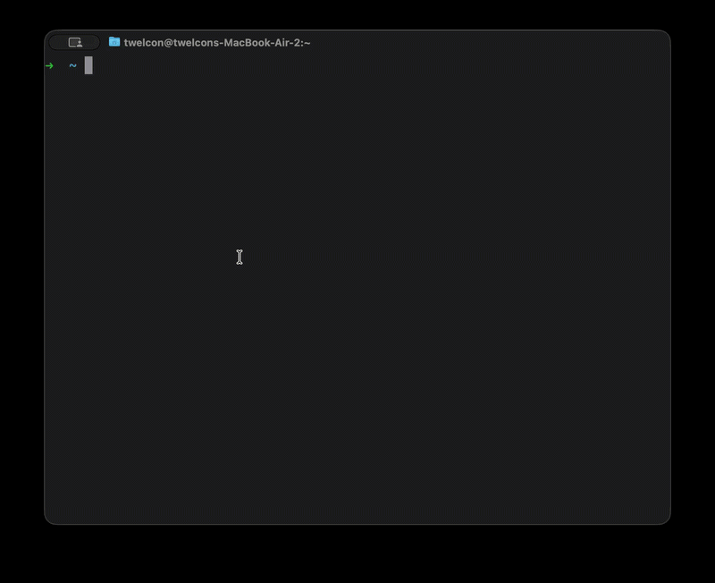
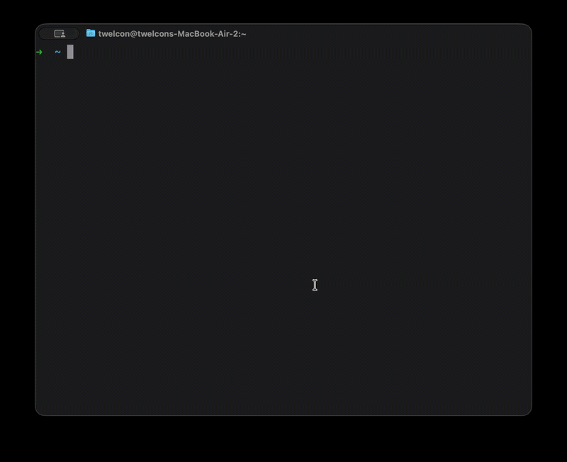

# XSH


> Stop typing long SSH commands. Save hosts, run commands, and switch environments instantly.

[](https://golang.org/)
[](LICENSE)


## Overview

XSH extends SSH functionality by providing a unified interface for storing, managing, and executing SSH connections. It eliminates the need to remember complex SSH commands, IP addresses, and configuration details by storing everything in a local SQLite database.

## Features

- **Centralized Configuration** — Store all SSH connection details in a structured SQLite database
- **Simple Identifiers** — Connect to hosts using easy-to-remember names instead of IP addresses
- **Jump Host Support** — Built-in support for SSH jump hosts (bastion servers)
- **Identity Management** — Manage multiple SSH identity files with ease
- **Region Tagging** — Organize hosts by region with custom slugs
- **Flexible Output** — Retrieve connection details in various formats for scripting

## Installation

### Install From Github
- Go to release section of xsh repo, https://github.com/killshotrevival/xsh/releases

- Download the desired cli

or you can use the following script directly

```bash
curl https://raw.githubusercontent.com/killshotrevival/xsh/refs/heads/main/install.sh | bash -
```

### Build From Source
```bash
git clone https://github.com/killshotrevival/xsh.git
cd xsh

make build

# Placing the binary in required directory
mkdir -p ~/.local/bin
mv xsh ~/.local/bin/
chmod +x ~/.local/bin/xsh

# Make sure the binary directory is present under $PATH
echo 'export PATH="$HOME/.local/bin:$PATH"' >> ~/.bashrc   # or ~/.zshrc

```

## System Init
```bash
xsh init
```
This command will initialize the xsh environment as well as read the following files to populate the database for configurations:

- Identities in .ssh: Will look for all the identities files present in the .ssh directory and populate them in the database
- .ssh/config (TODO): Read the config file for populating the already present host configurations
- .zshrc / .bashrc (TODO): Read the config file for populating the already present host configurations


## Quick Start

### Add New Resources
```bash
# This command will add a new region in the database that can be mapped to hosts
xsh put region us-east-1

# This command will add a new identity file using a unique name and its complete path
xsh put identity twelcon-development /Users/twelcon/.ssh/development

# Create an example file, that can be used for creating a new host
xsh example host -f host.json

# This command will add a new host according to the values declared in host.
xsh put host -f host.json

# This command can be used for viewing a list of all the hosts present
xsh get host
```

### Connecting To A Host
```bash
xsh connect host-1

# To connect in verbose mode
xsh connect host-1 -v
```

## Pro Tips 😉

### Clone A Host
In situation where maximum properties of a new host matches a host already present in the database, it makes more sense to clone a host instead of creating a new one from scratch
```bash
xsh put h
```



### Delete Resources interactively
Select resource to delete interactively and delete them
```bash
xsh delete
```



### For More Details
Please follow [this](./docs/xsh.md) for more information

## Roadmap 🚴🏻

For a detailed look at upcoming features — including remote backend support, SCP integration, direct SSH config management, and resource tagging — see the [Roadmap](Plan.md).

## Database Schema

XSH uses SQLite to store configuration with the following structure:

| Table | Description |
|-------|-------------|
| `hosts` | Host connection details (address, user, identity, jumphost) |
| `identities` | SSH identity files (name, path) |
| `regions` | Geographic regions for organization (name) |

## Configuration

The database is stored at `~/.xsh/xsh.db` by default. Override with:

```bash
export XSH_DB_PATH=/custom/path/config.db
```

## Contributing

Contributions are welcome! Please feel free to submit a Pull Request.

## License

This project is licensed under the MIT License - see the [LICENSE](LICENSE) file for details.
